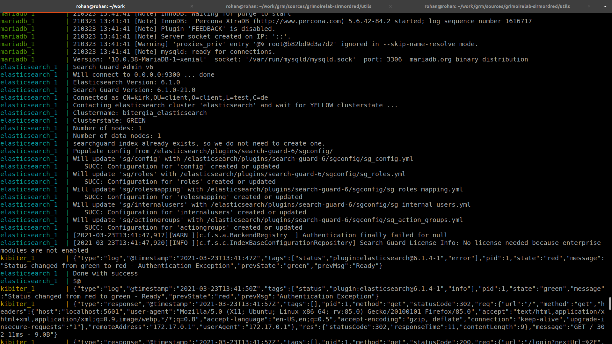

# Execute micro-mordred to collect, enrich and visualize data from Git repositories.

I setup elasticsearch, kibiter, mariadb using docker-compose as mentioned in [tutorial](https://chaoss.github.io/grimoirelab-tutorial/sirmordred/micro-mordred.html).

I got an error,  `access denied for 'augur'@172.17.0.1` if anyone else faced the same problem you can look [here](https://medium.com/tech-learn-share/docker-mysql-access-denied-for-user-172-17-0-1-using-password-yes-c5eadad582d3).

Collecting and enriching data.

`python3 micro.py --raw --enrich --cfg setup.cfg --backends git`

Building Panels

`python3 micro.py --panels --cfg setup.cfg`

