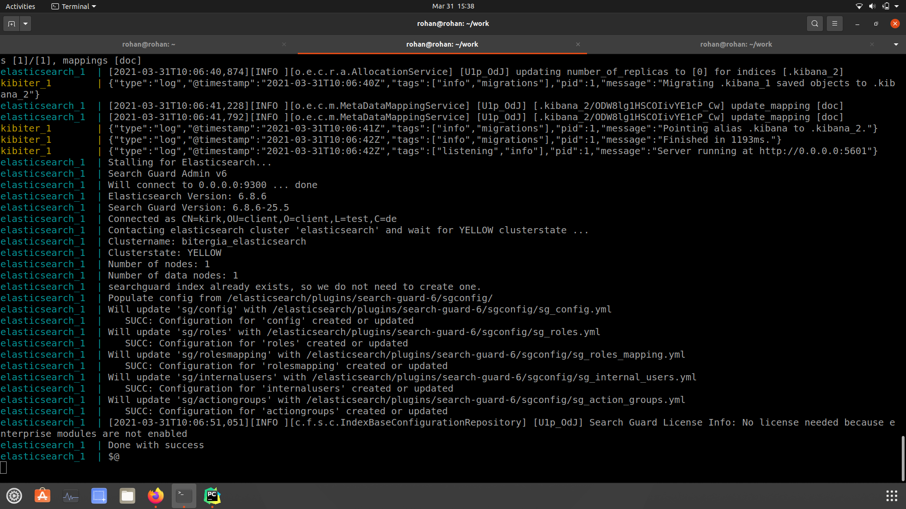
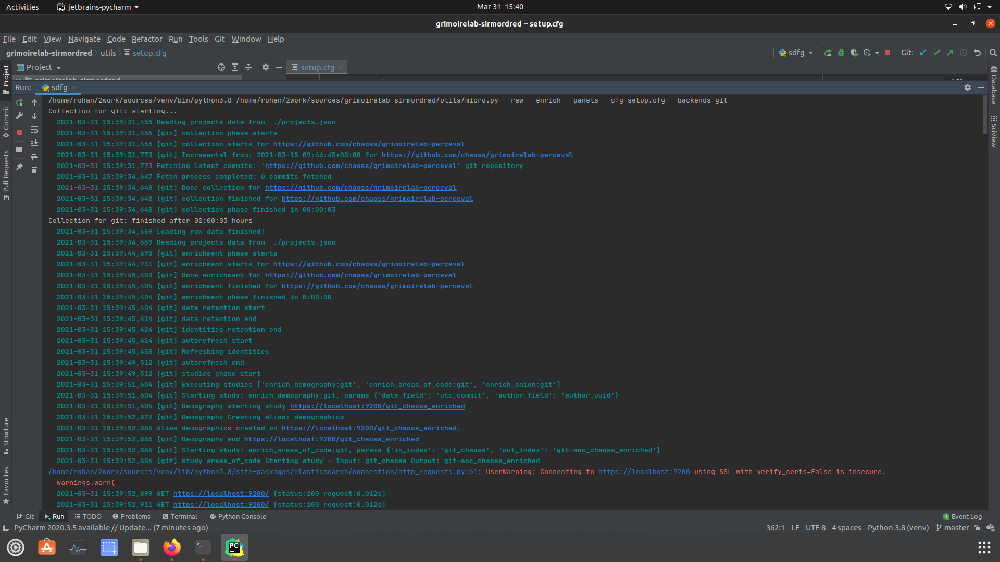
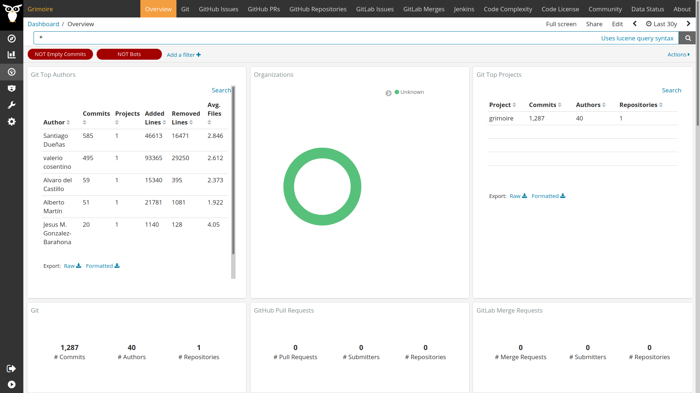

# Execute micro-mordred to collect, enrich and visualize data from Git repositories.

I setup elasticsearch, kibiter, mariadb using docker-compose.

```
services:
  elasticsearch:
    image: bitergia/elasticsearch:6.8.6-secured
    command: elasticsearch -Enetwork.bind_host=0.0.0.0 -Ehttp.max_content_length=2000mb
    ports:
      - 9200:9200
    environment:
      - ES_JAVA_OPTS=-Xms2g -Xmx2g

  kibiter:
    restart: on-failure:5
    image: bitergia/kibiter:secured-v6.8.6-3
    environment:
      - PROJECT_NAME=Demo
      - NODE_OPTIONS=--max-old-space-size=1000
      - ELASTICSEARCH_USER=kibanaserver
      - ELASTICSEARCH_PASSWORD=kibanaserver
      - ELASTICSEARCH_URL=["https://elasticsearch:9200"]
      - LOGIN_SUBTITLE=If you have forgotten your username or password ...
    links:
      - elasticsearch
    ports:
      - 5601:5601
```



I got an error,  `access denied for 'augur'@172.17.0.1` if anyone else faced the same problem you can look [here](https://medium.com/tech-learn-share/docker-mysql-access-denied-for-user-172-17-0-1-using-password-yes-c5eadad582d3).

Collecting and enriching data.

`python3 micro.py --raw --enrich --cfg setup.cfg --backends git`

Building Panels

`python3 micro.py --panels --cfg setup.cfg`




