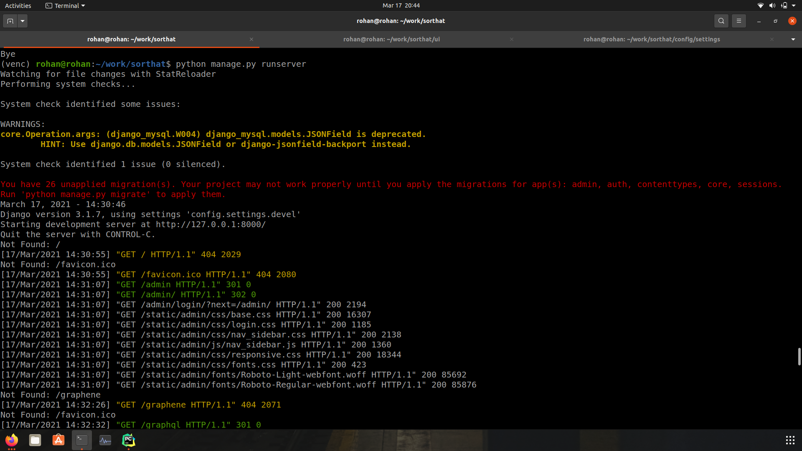

# Setting up developer environment for muggle branch of SortingHat

```
git clone https://github.com/chaoss/grimoirelab-sortinghat/
git switch muggle
cd grimoire-lab-sortinghat
virtualenv $location (and activate this)

pip install -r requirements.txt

cd ui
yarn install yarn serve
```





