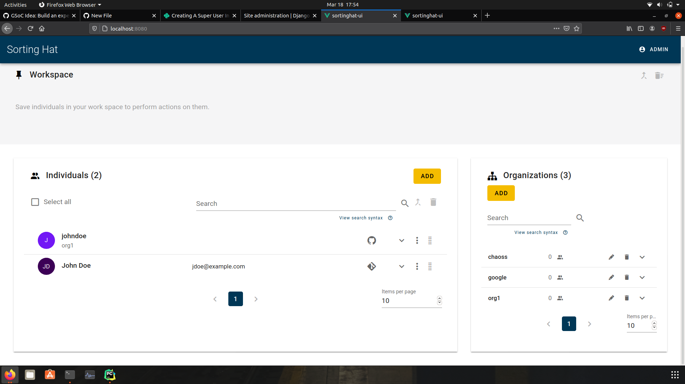
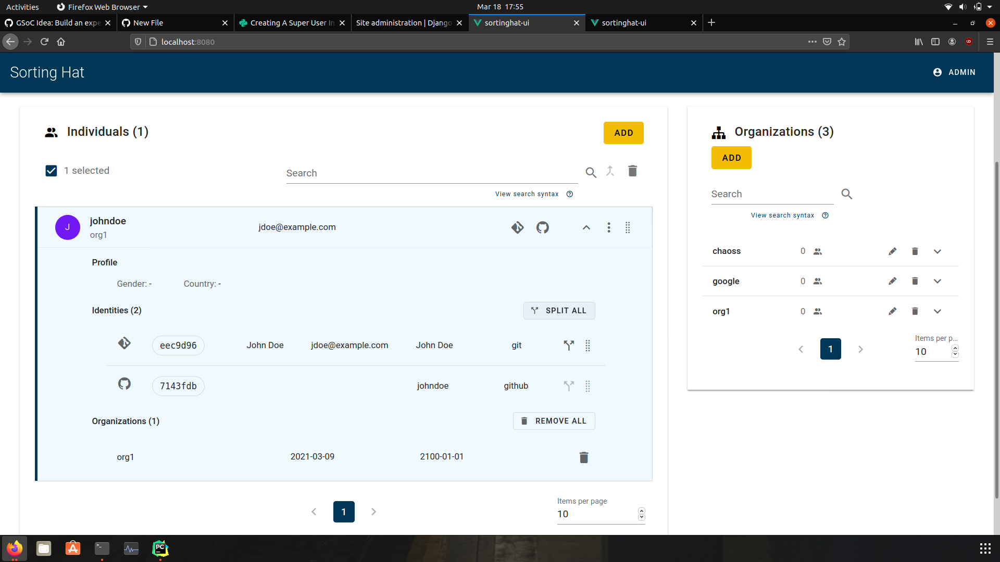
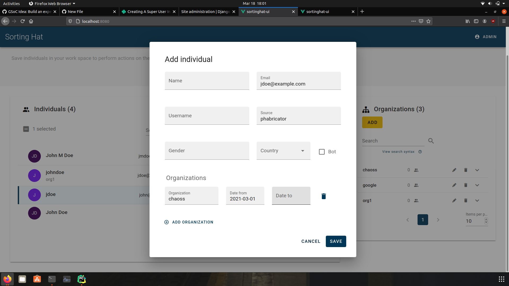
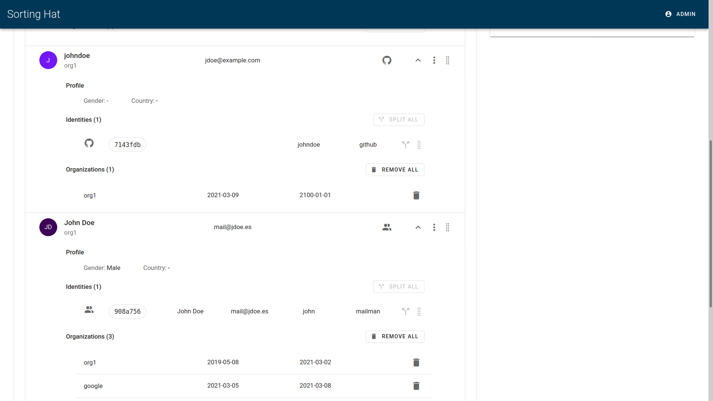
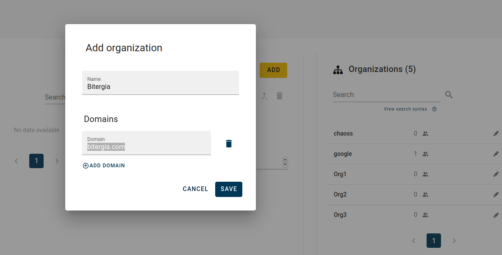
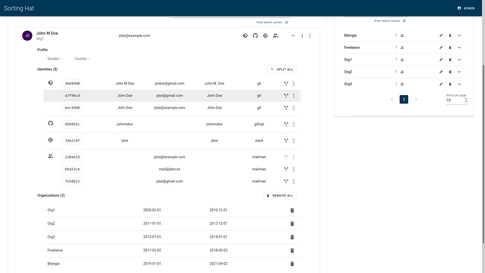

# Create a saample profile with different identities using the Sortinghat UI

After setting up the developer environment for sortinghat muggle branch and starting the Vue app and Django server. 

Through the Sortinghat UI adding profiles. 

### After adding all the organisations

### After adding all the identities

### After merging all the identities

