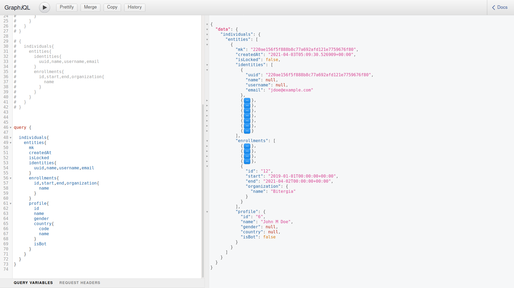

# Using the SortingHat GraphQL Console, create a query that fetches the data (identities, enrollments) of an individual profile.

After executing the following query on the data entered above the results are:

```
query {
  
  individuals{
    entities{
      mk
      createdAt
      isLocked
      identities{
        uuid,name,username,email
      }
      enrollments{
        id,start,end,organization{
          name
        }
      }
      profile{
        id
        name
        gender
        country{
          code
          name
        }
        isBot
      }
    }
  }
}
```
### Result

```
{
  "data": {
    "individuals": {
      "entities": [
        {
          "mk": "220ae156f5f888b8c77a692afd121e7759676f80",
          "createdAt": "2021-04-03T05:09:30.526909+00:00",
          "isLocked": false,
          "identities": [
            {
              "uuid": "220ae156f5f888b8c77a692afd121e7759676f80",
              "name": null,
              "username": null,
              "email": "jdoe@example.com"
            },
            {
              "uuid": "36d49d82144e058929d713923f922bc3e9446287",
              "name": "John M Doe",
              "username": "John M. Doe",
              "email": "jmdoe@gmail.com"
            },
            {
              "uuid": "6ba53cef6b5aaa86d83052bf190e10c0ad0a3399",
              "name": null,
              "username": null,
              "email": "mail@jdoe.es"
            },
            {
              "uuid": "7da2c0f711781e244b0ee482d657f96ecca4ccbc",
              "name": "jdoe",
              "username": "jdoe",
              "email": null
            },
            {
              "uuid": "7e58b2112c689b728914e3598c32862e32a970da",
              "name": null,
              "username": null,
              "email": "jdoe@gmail.com"
            },
            {
              "uuid": "a7f98cd5f7feddeae8cf97890e5c227dba114f04",
              "name": "John Doe",
              "username": "John Doe",
              "email": "jdoe@gmail.com"
            },
            {
              "uuid": "d56955c0bdc32bb834fe9f37defbf6f4d54384d3",
              "name": "johnmdoe",
              "username": "johnmdoe",
              "email": null
            },
            {
              "uuid": "eec9d9686e58a3cce3edc149c98fa61c45ccba0c",
              "name": "John Doe",
              "username": "John Doe",
              "email": "jdoe@example.com"
            }
          ],
          "enrollments": [
            {
              "id": "8",
              "start": "2005-02-01T00:00:00+00:00",
              "end": "2010-12-01T00:00:00+00:00",
              "organization": {
                "name": "Org1"
              }
            },
            {
              "id": "9",
              "start": "2011-01-01T00:00:00+00:00",
              "end": "2012-12-01T00:00:00+00:00",
              "organization": {
                "name": "Org2"
              }
            },
            {
              "id": "10",
              "start": "2013-01-01T00:00:00+00:00",
              "end": "2014-01-01T00:00:00+00:00",
              "organization": {
                "name": "Org3"
              }
            },
            {
              "id": "11",
              "start": "2017-02-02T00:00:00+00:00",
              "end": "2018-05-03T00:00:00+00:00",
              "organization": {
                "name": "Freelance"
              }
            },
            {
              "id": "12",
              "start": "2019-01-01T00:00:00+00:00",
              "end": "2021-04-02T00:00:00+00:00",
              "organization": {
                "name": "Bitergia"
              }
            }
          ],
          "profile": {
            "id": "6",
            "name": "John M Doe",
            "gender": null,
            "country": null,
            "isBot": false
          }
        }
      ]
    }
  }
}
```



