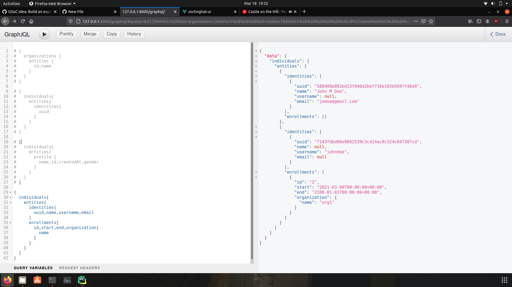

# Using the SortingHat GraphQL Console, create a query that fetches the data (identities, enrollments) of an individual profile.

```
{
  individuals{
    entities{
      identities{
        uuid,name,username,email
      }
      enrollments{
        id,start,end,organization{
          name
        }
      }
    }
  }
}
```


