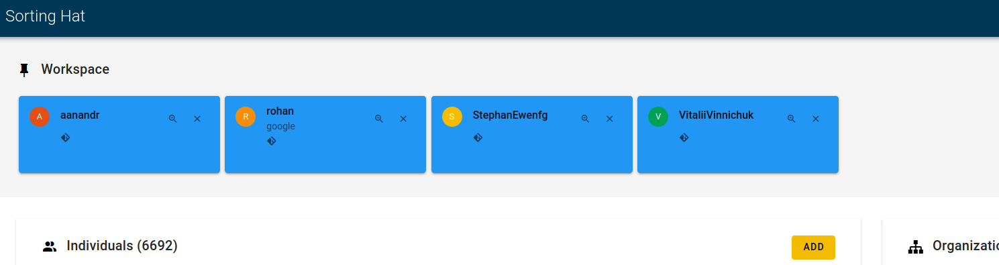

#  Improve the visualization of the individualCards component.

`individualCard` componenet is used to show the pinned individuals at the top of the workspace. I added `isBot` which shows the bot icon. I am still working on this. 

**[Sortinghat repo commit](https://github.com/SteveKola/grimoirelab-sortinghat/commit/6749c0d76a4328255b87823971d327c5d2a8f3f2)**

